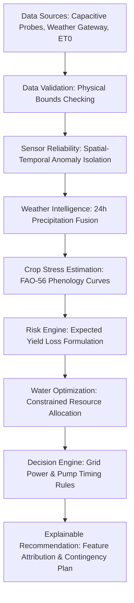

# 🌱 AgriTrust — Risk-Aware Agricultural Decision Intelligence

> **"Don't just irrigate. Prioritize risk."**  
> *Turn uncertain farm data into confident decisions.*

[](https://react.dev/)
[](https://www.typescriptlang.org/)
[](https://vitejs.dev/)
[](https://tailwindcss.com/)
[](#)

---

## 📌 The Real Problem

Farmers often make irrigation, crop-care, and resource-use decisions without timely and reliable information about soil moisture, weather conditions, crop health, and water availability. This leads to over-irrigation, under-irrigation, resource waste, crop stress, and increased farming costs.

### ⚡ Our Specific Real-World Gap

Most smart farming systems simply answer:
> *"When should I irrigate?"*  
> (Assuming infinite water and flawless hardware)

**AgriTrust** addresses the harder real-world agricultural question:
> **"What should the farmer do when water is limited, sensor information is uncertain, weather changes, or the farmer cannot follow the ideal recommendation?"**

---

## 🌟 Core Flow: `WATER → RISK → PRIORITY → ACTION`


1. **Water:** Calculates reservoir limits and deficit constraints.
2. **Risk:** Evaluates soil moisture depletion against FAO-56 crop growth stage vulnerability (e.g., Flowering Tomato has high yield loss risk).
3. **Priority:** Ranks fields by economic loss severity (`#1 Tomato`, `#2 Chilli`, `#3 Groundnut`).
4. **Action:** Assigns exact runtime minutes and proposes contingency alternatives if grid power is unavailable.

---

## 🚀 Key Features

### 💧 1. Water Allocation Simulator (Signature Feature)
- Interactive reservoir slider (`500 L → 5,000 L`) with real-time reallocation bar charts.
- **Rain Tomorrow Toggle:** (`No Rain`, `Light Rain`, `Heavy Rain`). If heavy rain (28mm) arrives, Groundnut skips completely, Chilli delays to harvest natural rainfall, saving reservoir water and electricity.

### 🛡️ 2. Sensor Reliability & Fault Injection
- Detects broken, drifting, or short-circuited probes.
- **Interactive Fault Injection:** Simulates Tomato sensor reading 85% (wet saturation) while ambient conditions are 34°C with 0mm rainfall.
- AgriTrust catches the anomaly via cross-field and ET0 balance, penalizes sensor confidence, and prevents fatal crop desiccation.

### 🌾 3. Farmer's Choice of Crop
- Swap or assign crops for any field zone on the fly.
- **10 Agronomic Presets:** Tomato, Chilli, Groundnut, Cotton, Maize, Paddy/Rice, Wheat, Onion, Potato, Soybean.
- Dynamically updates optimal soil moisture ranges, stress indices, and allocation priorities.

### 🌐 4. Multi-Language Support (7 Languages)
- Instant, seamless UI localization for:
  - 🇬🇧 **English**
  - 🇮🇳 **हिन्दी (Hindi)**
  - 🇮🇳 **తెలుగు (Telugu)**
  - 🇮🇳 **தமிழ் (Tamil)**
  - 🇮🇳 **ಕನ್ನಡ (Kannada)**
  - 🇮🇳 **मराठी (Marathi)**
  - 🇪🇸 **Español (Spanish)**

### 🧠 5. Explainable Decision Intelligence
- Full attribution breakdown: Soil Moisture (80%), Rain Probability (20%), Crop Stage (90%), Temperature (70%), Water Availability (40%).
- 6-step deterministic logic trace with no black-box obfuscation.

### ⚡ 6. Constraint-Aware Scheduling
- Farmer constraints: pump delivery capacity (25 L/min), daily budget ceiling, and grid power availability.
- When electricity is restricted (e.g. 7 AM – 9 AM), AgriTrust shifts irrigation from the ideal 6:30 PM evening window to 7:00 AM cool morning hours.

### 🏆 7. Special Evaluation Modes
- **JUDGE DEMO (90s):** Automated, 10-step guided tour walking judges through the baseline, drought shock, rain forecast, and sensor fault injection.
- **Technical View:** Transparent architecture pipeline clearly labeling AI/ML vs. Deterministic Rules vs. Constrained Optimization.

---

## 🏗️ Technical Architecture



---

## 💻 Tech Stack

- **Framework:** [React 19](https://react.dev/) + [Vite 8](https://vitejs.dev/)
- **Language:** [TypeScript](https://www.typescriptlang.org/)
- **Styling:** [Tailwind CSS v4](https://tailwindcss.com/)
- **Visuals & Charts:** [Recharts](https://recharts.org/), [Lucide React](https://lucide.dev/)
- **Zero Paid APIs:** All data runs locally with a deterministic biophysical simulation layer.

---

## 🛠️ Getting Started Locally

### Prerequisites
- Node.js (v18 or higher)
- npm or yarn

### Installation
```bash
# Clone the repository
git clone https://github.com/dubbajahnavi30/agritrust.git

# Navigate to project directory
cd agritrust

# Install dependencies
npm install

# Start local development server
npm run dev
```

Open **`http://127.0.0.1:5173/`** in your browser.

### Production Build
```bash
npm run build
```

---

## 📜 License
This project was built for the **Smart Agriculture & Farming Hackathon**. Released under the MIT License.
